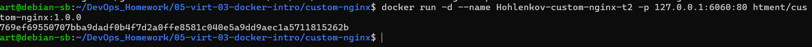
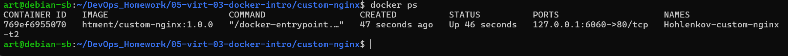
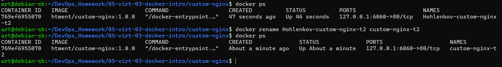

# Домашнее задание к занятию 4 «Оркестрация группой Docker контейнеров на примере Docker Compose»

# Задача 1

Установите docker и docker compose plugin на свою linux рабочую станцию или ВМ.
Если dockerhub недоступен создайте файл /etc/docker/daemon.json с содержимым: {"registry-mirrors": ["https://mirror.gcr.io", "https://daocloud.io", "https://c.163.com/", "https://registry.docker-cn.com"]}


скачайте образ nginx:1.29.0;
Создайте Dockerfile и реализуйте в нем замену дефолтной индекс-страницы(/usr/share/nginx/html/index.html), на файл index.html с содержимым:
```
<html>
<head>
Hey, Netology
</head>
<body>
<h1>I will be DevOps Engineer!</h1>
</body>
</html>
```
Соберите и отправьте созданный образ в свой dockerhub-репозитории c tag 1.0.0 (ТОЛЬКО ЕСЛИ ЕСТЬ ДОСТУП).
Предоставьте ответ в виде ссылки на https://hub.docker.com/<username_repo>/custom-nginx/general .

# Решение

Установите Docker и Docker Compose plugin:
```
sudo apt-get update
sudo apt-get install -y docker.io docker-compose-plugin
```
## Настройте Docker Daemon
```
sudo nano /etc/docker/daemon.json
```
-->
```
{"registry-mirrors": ["https://mirror.gcr.io", "https://daocloud.io", "https://c.163.com/", "https://registry.docker-cn.com"]}
```
```
sudo systemctl restart docker

```

## Скачайте образ nginx:1.29.0:
```
docker pull nginx:1.29.0
```

Создадим рабочуу директорию
```
mkdir ./custom-nginx && cd ./custom-nginx
```
Создайте файл index.html с заданным содержимым:
```
cat > index.html << EOF
<html>
<head>
Hey, Netology
</head>
<body>
<h1>I will be DevOps Engineer!</h1>
</body>
</html>
EOF
```
Создайте Dockerfile:
```
cat > Dockerfile << EOF
FROM nginx:1.29.0
COPY index.html /usr/share/nginx/html/index.html
EOF
```

Соберите образ
```
docker build -t htment/custom-nginx:1.0.0 .
```

Отправьте образ в репозиторий
```
docker login
docker push htment/custom-nginx:1.0.0
```


Cсылку на репозиторий:
https://hub.docker.com/repository/docker/htment/custom-nginx/general


# Задача 2
Запустите ваш образ custom-nginx:1.0.0 командой docker run в соответвии с требованиями:
имя контейнера "ФИО-custom-nginx-t2"
контейнер работает в фоне
контейнер опубликован на порту хост системы 127.0.0.1:8080
Не удаляя, переименуйте контейнер в "custom-nginx-t2"
Выполните команду date +"%d-%m-%Y %T.%N %Z" ; sleep 0.150 ; docker ps ; ss -tlpn | grep 127.0.0.1:8080  ; docker logs custom-nginx-t2 -n1 ; docker exec -it custom-nginx-t2 base64 /usr/share/nginx/html/index.html
Убедитесь с помощью curl или веб браузера, что индекс-страница доступна.
В качестве ответа приложите скриншоты консоли, где видно все введенные команды и их вывод.
# Решение

## 1. Запуск контейнера с указанными параметрами
```
docker run -d --name ФИО-custom-nginx-t2 -p 127.0.0.1:8080:80 htment/custom-nginx:1.0.0
```

порт занят 

проверяем


удалим 


```
 docker rm -f 3e0437fb0a86
```
возмем другой порт
```
docker run -d --name Hohlenkov-custom-nginx-t2 -p 127.0.0.1:6060:80 htment/custom-nginx:1.0.0
```



## 2. Переименование контейнера (ФИО замените на свои инициалы)
```
 docker rename Hohlenkov-custom-nginx-t2 custom-nginx-t2
```


## 3. Выполнение команды для проверки
```
date +"%d-%m-%Y %T.%N %Z" ; sleep 0.150 ; docker ps ; ss -tlpn | grep 127.0.0.1:6060  ; docker logs custom-nginx-t2 -n1 ; docker exec -it custom-nginx-t2 base64 /usr/share/nginx/html/index.html
```

## 4. Проверка доступности через curl
``
curl http://127.0.0.1:6060
``

## или проверка в браузере
``
xdg-open http://127.0.0.1:6060
``

# Задача 3
Воспользуйтесь docker help или google, чтобы узнать как подключиться к стандартному потоку ввода/вывода/ошибок контейнера "custom-nginx-t2".
Подключитесь к контейнеру и нажмите комбинацию Ctrl-C.
Выполните docker ps -a и объясните своими словами почему контейнер остановился.

Перезапустите контейнер

Зайдите в интерактивный терминал контейнера "custom-nginx-t2" с оболочкой bash.

Установите любимый текстовый редактор(vim, nano итд) с помощью apt-get.

Отредактируйте файл "/etc/nginx/conf.d/default.conf", заменив порт "listen 80" на "listen 81".

Запомните(!) и выполните команду nginx -s reload, а затем внутри контейнера curl http://127.0.0.1:80 ; curl http://127.0.0.1:81.


Выйдите из контейнера, набрав в консоли exit или Ctrl-D.
Проверьте вывод команд: ss -tlpn | grep 127.0.0.1:8080 , docker port custom-nginx-t2, curl http://127.0.0.1:8080. Кратко объясните суть возникшей проблемы.

Это дополнительное, необязательное задание. Попробуйте самостоятельно исправить конфигурацию контейнера, используя доступные источники в интернете. Не изменяйте конфигурацию nginx и не удаляйте контейнер. Останавливать контейнер можно. пример источника
Удалите запущенный контейнер "custom-nginx-t2", не останавливая его.(воспользуйтесь --help или google)
В качестве ответа приложите скриншоты консоли, где видно все введенные команды и их вывод.