# Домашнее задание к занятию 4 «Оркестрация группой Docker контейнеров на примере Docker Compose»

# Задача 1

Установите docker и docker compose plugin на свою linux рабочую станцию или ВМ.
Если dockerhub недоступен создайте файл /etc/docker/daemon.json с содержимым: {"registry-mirrors": ["https://mirror.gcr.io", "https://daocloud.io", "https://c.163.com/", "https://registry.docker-cn.com"]}


скачайте образ nginx:1.29.0;
Создайте Dockerfile и реализуйте в нем замену дефолтной индекс-страницы(/usr/share/nginx/html/index.html), на файл index.html с содержимым:
```
<html>
<head>
Hey, Netology
</head>
<body>
<h1>I will be DevOps Engineer!</h1>
</body>
</html>
```
Соберите и отправьте созданный образ в свой dockerhub-репозитории c tag 1.0.0 (ТОЛЬКО ЕСЛИ ЕСТЬ ДОСТУП).
Предоставьте ответ в виде ссылки на https://hub.docker.com/<username_repo>/custom-nginx/general .

# Решение

Установите Docker и Docker Compose plugin:
```
sudo apt-get update
sudo apt-get install -y docker.io docker-compose-plugin
```
## Настройте Docker Daemon
```
sudo nano /etc/docker/daemon.json
```
-->
```
{"registry-mirrors": ["https://mirror.gcr.io", "https://daocloud.io", "https://c.163.com/", "https://registry.docker-cn.com"]}
```
```
sudo systemctl restart docker

```

## Скачайте образ nginx:1.29.0:
```
docker pull nginx:1.29.0
```
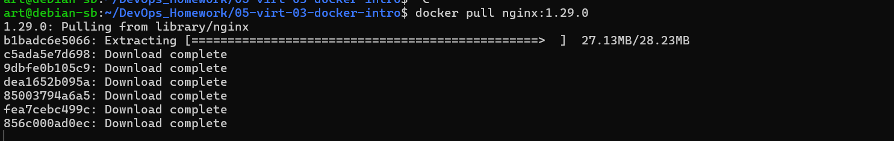
Создадим рабочуу директорию
```
mkdir ./custom-nginx && cd ./custom-nginx
```
Создайте файл index.html с заданным содержимым:
```
cat > index.html << EOF
<html>
<head>
Hey, Netology
</head>
<body>
<h1>I will be DevOps Engineer!</h1>
</body>
</html>
EOF
```
Создайте Dockerfile:
```
cat > Dockerfile << EOF
FROM nginx:1.29.0
COPY index.html /usr/share/nginx/html/index.html
EOF
```

Соберите образ
```
docker build -t htment/custom-nginx:1.0.0 .
```
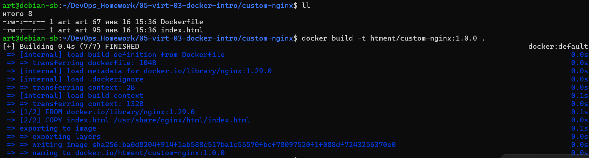
Отправьте образ в репозиторий
```
docker login
docker push htment/custom-nginx:1.0.0
```
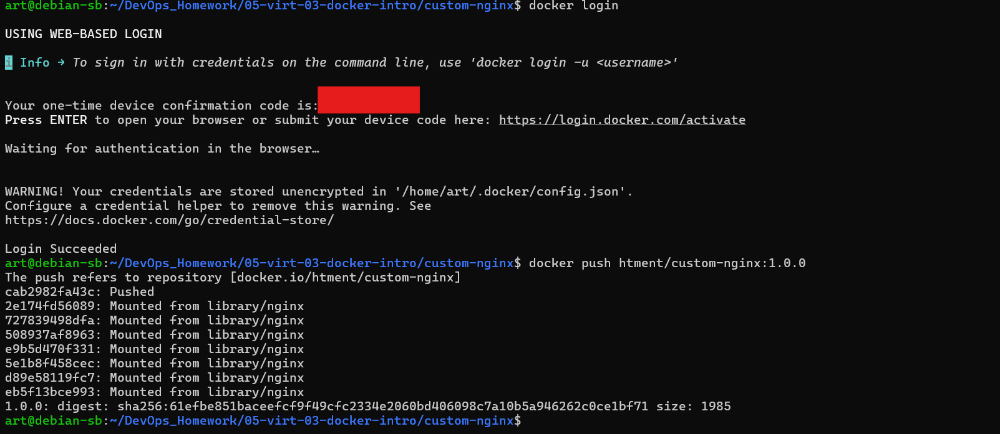

Cсылку на репозиторий:
https://hub.docker.com/repository/docker/htment/custom-nginx/general


# Задача 2
Запустите ваш образ custom-nginx:1.0.0 командой docker run в соответвии с требованиями:
имя контейнера "ФИО-custom-nginx-t2"
контейнер работает в фоне
контейнер опубликован на порту хост системы 127.0.0.1:8080
Не удаляя, переименуйте контейнер в "custom-nginx-t2"
Выполните команду date +"%d-%m-%Y %T.%N %Z" ; sleep 0.150 ; docker ps ; ss -tlpn | grep 127.0.0.1:8080  ; docker logs custom-nginx-t2 -n1 ; docker exec -it custom-nginx-t2 base64 /usr/share/nginx/html/index.html
Убедитесь с помощью curl или веб браузера, что индекс-страница доступна.
В качестве ответа приложите скриншоты консоли, где видно все введенные команды и их вывод.
# Решение

## 1. Запуск контейнера с указанными параметрами
```
docker run -d --name ФИО-custom-nginx-t2 -p 127.0.0.1:8080:80 htment/custom-nginx:1.0.0
```

порт занят 

проверяем
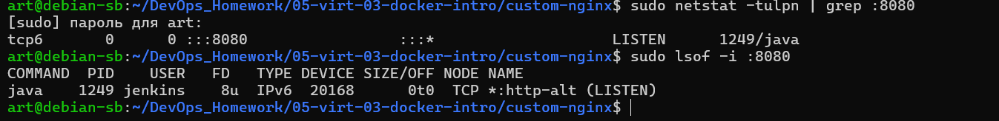

удалим 

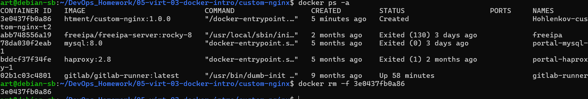

```
 docker rm -f 3e0437fb0a86
```
возмем другой порт
```
docker run -d --name HAV-custom-nginx-t2 -p 127.0.0.1:6060:80 htment/custom-nginx:1.0.0
```
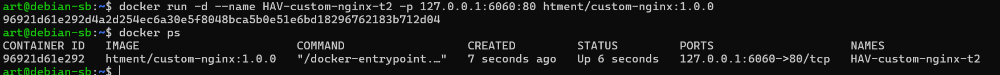

## 2. Переименование контейнера (ФИО замените на свои инициалы)
```
 docker rename HAV-custom-nginx-t2 custom-nginx-t2
```


## 3. Выполнение команды для проверки
```
date +"%d-%m-%Y %T.%N %Z" ; sleep 0.150 ; docker ps ; ss -tlpn | grep 127.0.0.1:6060  ; docker logs custom-nginx-t2 -n1 ; docker exec -it custom-nginx-t2 base64 /usr/share/nginx/html/index.html
```
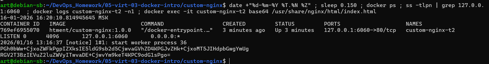
## 4. Проверка доступности через curl
``
curl http://127.0.0.1:6060
``
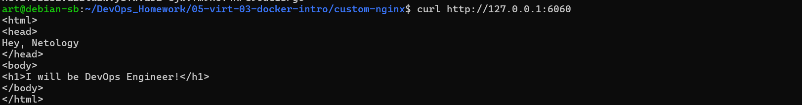
## или проверка в браузере
``
xdg-open http://127.0.0.1:6060
``

# Задача 3
Воспользуйтесь docker help или google, чтобы узнать как подключиться к стандартному потоку ввода/вывода/ошибок контейнера "custom-nginx-t2".
Подключитесь к контейнеру и нажмите комбинацию Ctrl-C.
Выполните docker ps -a и объясните своими словами почему контейнер остановился.

Перезапустите контейнер

Зайдите в интерактивный терминал контейнера "custom-nginx-t2" с оболочкой bash.

Установите любимый текстовый редактор(vim, nano итд) с помощью apt-get.

Отредактируйте файл "/etc/nginx/conf.d/default.conf", заменив порт "listen 80" на "listen 81".

Запомните(!) и выполните команду nginx -s reload, а затем внутри контейнера curl http://127.0.0.1:80 ; curl http://127.0.0.1:81.


Выйдите из контейнера, набрав в консоли exit или Ctrl-D.
Проверьте вывод команд: ss -tlpn | grep 127.0.0.1:8080 , docker port custom-nginx-t2, curl http://127.0.0.1:8080. Кратко объясните суть возникшей проблемы.

Это дополнительное, необязательное задание. Попробуйте самостоятельно исправить конфигурацию контейнера, используя доступные источники в интернете. Не изменяйте конфигурацию nginx и не удаляйте контейнер. Останавливать контейнер можно. пример источника
Удалите запущенный контейнер "custom-nginx-t2", не останавливая его.(воспользуйтесь --help или google)
В качестве ответа приложите скриншоты консоли, где видно все введенные команды и их вывод.
# Решение
```
 docker attach custom-nginx-t2
```
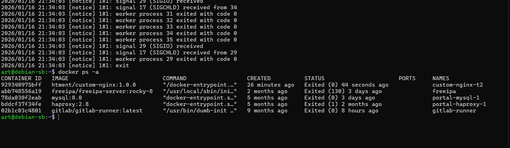
### Объяснение: 
Контейнер остановился потому, что при подключении через docker attach
мы подключаемся к основному процессу контейнера (nginx). Когда мы нажимаем Ctrl+C,
мы отправляем сигнал SIGINT основному процессу, что приводит к его завершению,
а значит и к остановке контейнера (так как контейнер работает, пока жив его основной процесс).

```
docker start custom-nginx-t2
```
Вход в интерактивный терминал с bash
```
docker exec -it custom-nginx-t2 bash
```
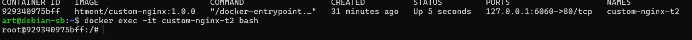

```
apt-get update && apt-get install -y nano
```
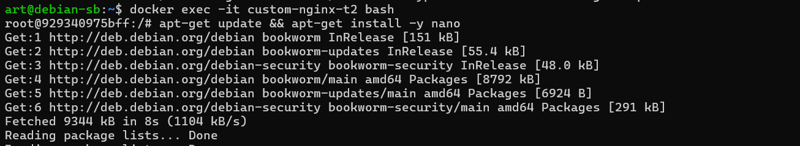
```
# 6. Редактирование конфигурации nginx
nano /etc/nginx/conf.d/default.conf
# Заменить строку "listen 80;" на "listen 81;"
# Сохранить изменения (Ctrl+O, Enter, Ctrl+X)

# 7. Перезагрузка конфигурации nginx и проверка
nginx -s reload
```
``curl http://127.0.0.1:80``

``curl http://127.0.0.1:81``


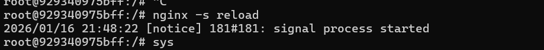


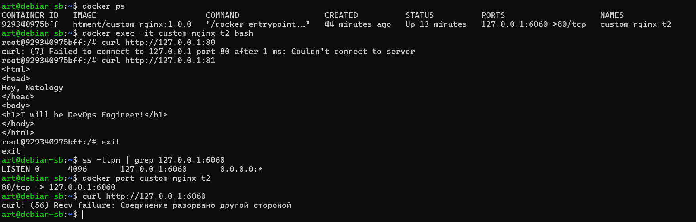


### Объяснение проблемы:
 После изменения порта в конфигурации nginx с 80 на 81,nginx внутри контейнера стал слушать порт 81. Однако при запуске контейнера мы пробросили порт 80 контейнера на порт 8080 хоста. Теперь порт 80 контейнера не слушается никаким процессом, поэтому соединения не проходят.

## без удаления контейнера нельзя изменить проброс портов.
некорректное задание
```
 Попробуйте самостоятельно исправить конфигурацию контейнера, используя доступные источники в интернете. Не изменяйте конфигурацию nginx и не удаляйте контейнер. Останавливать контейнер можно. пример источника
```
Даже в примере контейнер удаляют ... только зачем commit, если можно пересоздать с правильными параметрами

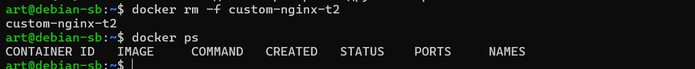

# Задача 4
Запустите первый контейнер из образа centos c любым тегом в фоновом режиме, подключив папку текущий рабочий каталог $(pwd) на хостовой машине в /data контейнера, используя ключ -v.
Запустите второй контейнер из образа debian в фоновом режиме, подключив текущий рабочий каталог $(pwd) в /data контейнера.
Подключитесь к первому контейнеру с помощью docker exec и создайте текстовый файл любого содержания в /data.
Добавьте ещё один файл в текущий каталог $(pwd) на хостовой машине.
Подключитесь во второй контейнер и отобразите листинг и содержание файлов в /data контейнера.
В качестве ответа приложите скриншоты консоли, где видно все введенные команды и их вывод.
# Решение
### 1. Создадим рабочую директорию и перейдем в нее
```
mkdir -p ./docker-volumes-test && cd ./docker-volumes-test
```
### 2. Запустим первый контейнер из образа centos
```
docker run -d --name centos-container -v $(pwd):/data centos:7 tail -f /dev/null
```
### 3. Запустим второй контейнер из образа debian
```
docker run -d --name debian-container -v $(pwd):/data debian:11 tail -f /dev/null
```
### 4. Проверим, что контейнеры запущены
```
docker ps
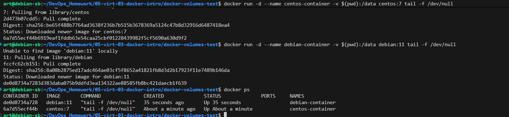
### 5. Подключимся к первому контейнеру (centos) и создадим файл
docker exec centos-container bash -c "echo 'Hello from CentOS container' > /data/centos-file.txt"
```
### 6. Создадим файл на хостовой машине в текущем каталоге
```
echo "Hello from Host machine" > host-file.txt
```
### 7. Подключимся ко второму контейнеру (debian) и проверим файлы
```
docker exec debian-container ls -la /data/
docker exec debian-container cat /data/centos-file.txt
docker exec debian-container cat /data/host-file.txt
```
### 8. Дополнительно: создадим файл из debian контейнера и проверим его на хосте
```
docker exec debian-container bash -c "echo 'Hello from Debian container' > /data/debian-file.txt"
ls -la
cat debian-file.txt
```
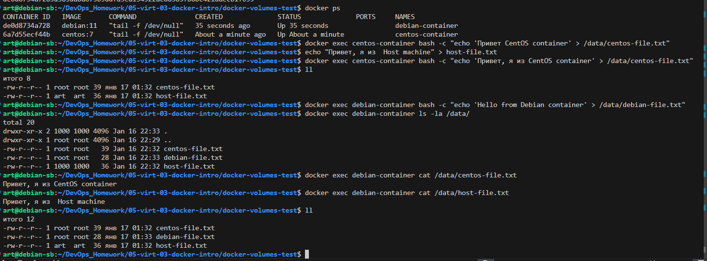


### 9. Очистка (опционально)
```
 docker stop centos-container debian-container
 docker rm centos-container debian-container
```


# Задача 5
Создайте отдельную директорию(например /tmp/netology/docker/task5) и 2 файла внутри него. "compose.yaml" с содержимым:
```
version: "3"
services:
  portainer:
    network_mode: host
    image: portainer/portainer-ce:latest
    volumes:
      - /var/run/docker.sock:/var/run/docker.sock
```
"docker-compose.yaml" с содержимым:
```
version: "3"
services:
  registry:
    image: registry:2

    ports:
    - "5000:5000"
```
И выполните команду ``"docker compose up -d"``. Какой из файлов был запущен и почему? (подсказка: https://docs.docker.com/compose/compose-application-model/#the-compose-file )

Отредактируйте файл compose.yaml так, чтобы были запущенны оба файла. (подсказка: https://docs.docker.com/compose/compose-file/14-include/)

Выполните в консоли вашей хостовой ОС необходимые команды чтобы залить образ custom-nginx как custom-nginx:latest в запущенное вами, локальное registry. Дополнительная документация: https://distribution.github.io/distribution/about/deploying/

Откройте страницу "https://127.0.0.1:9000" и произведите начальную настройку portainer.(логин и пароль адмнистратора)

Откройте страницу "http://127.0.0.1:9000/#!/home", выберите ваше local окружение. Перейдите на вкладку "stacks" и в "web editor" задеплойте следующий компоуз:
```
version: '3'

services:
  nginx:
    image: 127.0.0.1:5000/custom-nginx
    ports:
      - "9090:80"
```
Перейдите на страницу "http://127.0.0.1:9000/#!/2/docker/containers", выберите контейнер с nginx и нажмите на кнопку "inspect". В представлении <> Tree разверните поле "Config" и сделайте скриншот от поля "AppArmorProfile" до "Driver".

Удалите любой из манифестов компоуза(например compose.yaml). Выполните команду "docker compose up -d". Прочитайте warning, объясните суть предупреждения и выполните предложенное действие. Погасите compose-проект ОДНОЙ(обязательно!!) командой.

В качестве ответа приложите скриншоты консоли, где видно все введенные команды и их вывод, файл compose.yaml , скриншот portainer c задеплоенным компоузом.

# Решение


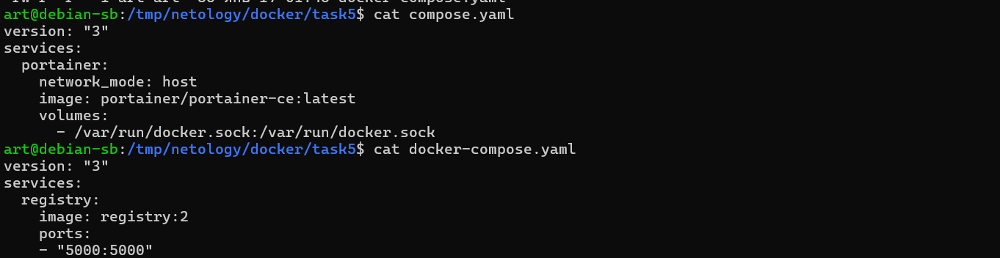
```
docker compose up -d
```
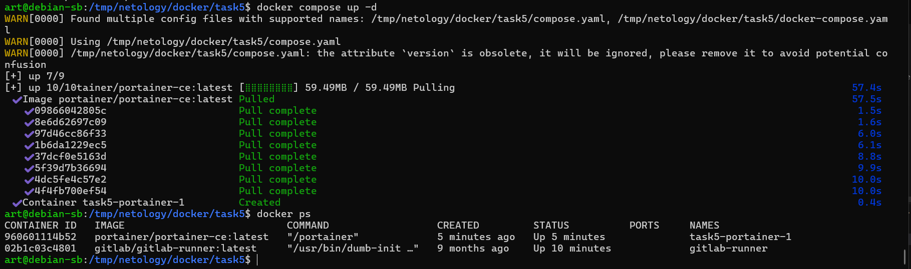
### Ответ на вопрос:
 Был запущен файл compose.yaml, потому что docker compose  по умолчанию ищет файлы с именами compose.yaml или compose.yml в первую очередь. docker-compose.yaml имеет более низкий приоритет.
### Редактируем compose.yaml для включения обоих файлов
```
cat > compose.yaml << 'EOF'
version: "3"
services:
  portainer:
    network_mode: host
    image: portainer/portainer-ce:latest
    volumes:
      - /var/run/docker.sock:/var/run/docker.sock
  
  registry:
    image: registry:2
    ports:
    - "5000:5000"
EOF
```
```
docker compose down
docker compose up -d
```

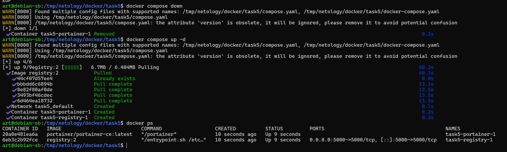


```
 http://127.0.0.1:9000/#!/2/docker/containers
```
так так это ВМ

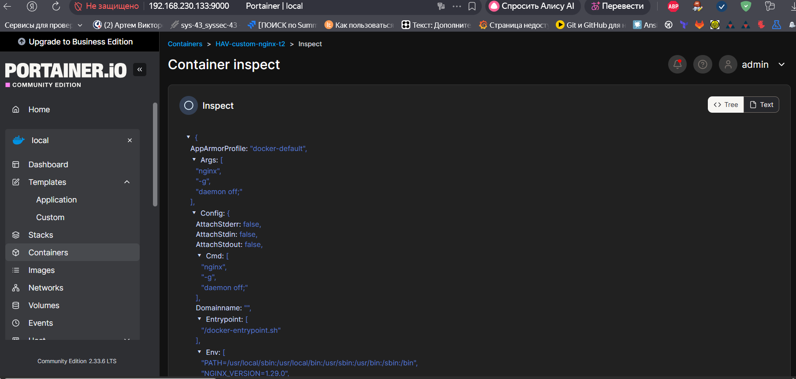


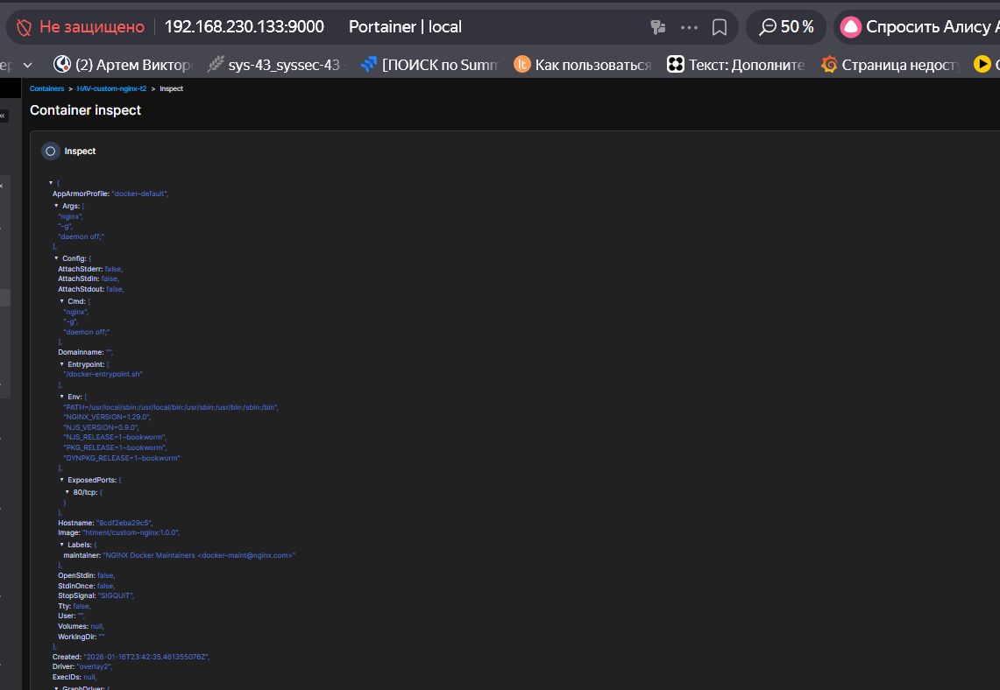
```
rm compose.yaml
```

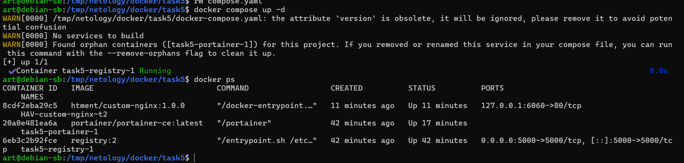
```
docker compose down
```
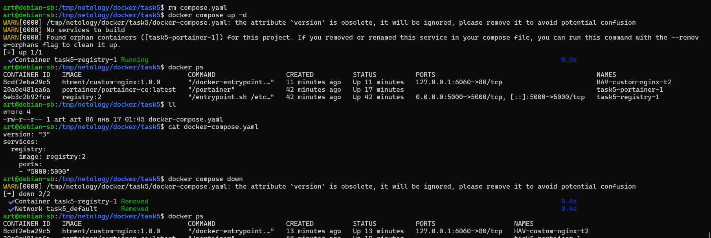